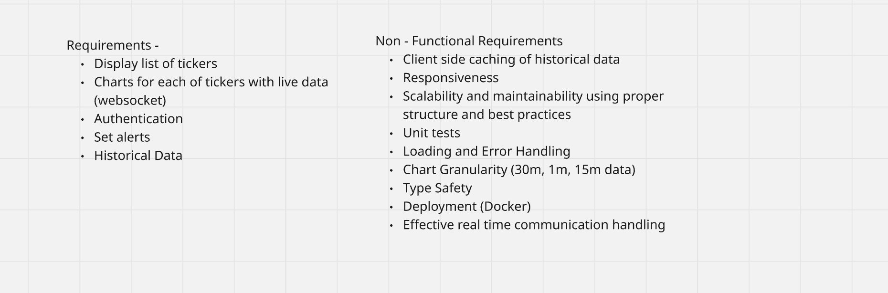
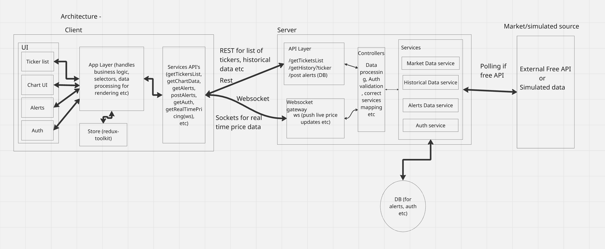

Real Time Trading Dashboard
High level Design

### Requirements -



### Hight Level Architecture



## Tech Stack

- **Frontend (FE)**: React, socket.io client, TypeScript, Jest, Chart.js, redux-toolkit
- **Backend (BE)**: Node.js, Express.js, WebSockets (socket.io)

---

## Data Model

### Ticker

- `id`: string (unique identifier)
- `symbol`: string (e.g., BTC, ETH)
- `name`: string (full asset/company name)
- `currency`: string (e.g., ETH, BTC)

### TickersList

- `tickers`: array of `Ticker`

### HistoryPoint

- `timestamp`: ISO 8601 UTC string
- `open`: number
- `high`: number
- `low`: number
- `close`: number
- `volume`: number

### Alert

- `id`: string
- `symbol`: string
- `name`: string
- `targetPrice`: number
- `createdAt`: ISO 8601 UTC string
- `isActive`: boolean
- `condition`: string (`above` | `below`)
- `userId`: string

---

### Trade-offs: Ticker List Rendering

There are two main approaches to rendering the ticker list with live pricing:

1. **FE merges REST + WS**
   - **REST** provides static metadata (symbol, name, type).
   - **WS** provides live price updates.
   - **Pros:** Simpler backend, flexible FE control.
   - **Cons:** More FE complexity, risk of mismatched timing if merging is not handled carefully.

2. **Unified BE feed (REST + WS combined)**
   - Backend merges static metadata with live prices.
   - FE subscribes to a single WS channel for unified payloads.
   - **Pros:** Simplifies FE logic, ensures consistency, easier scaling.
   - **Cons:** More backend complexity, BE must decide between sending full payloads or deltas.

**Best practice:** Use a hybrid model — initial snapshot (full payload) followed by delta updates — to balance efficiency and simplicity.

### Trade-offs: Subscription Lifecycle

For ticker list vs. chart views, there are two approaches:

- **Keep list feed active in background**
  - Pros: Faster navigation back, no resubscribe overhead.
  - Cons: Higher bandwidth and resource usage.

- **Unsubscribe when leaving list page**
  - Pros: Saves bandwidth and server load, cleaner state.
  - Cons: Requires resubscribe handshake when returning, slight delay.

**Best practice:** Use one WS connection with multiple channels. Subscribe/unsubscribe dynamically based on page context (list vs. chart), balancing resource efficiency with user experience.

## API Endpoints

### `POST /auth/login `

### `GET /tickers`

Returns list of available tickers.

```json
{
  "data": {
    "tickers": [
      { "id": "btc", "symbol": "BTC", "name": "Bitcoin", "currency": "BTC" },
      { "id": "eth", "symbol": "ETH", "name": "Ethereum.", "currency": "ETH" }
    ]
  }
}
```

### `GET /tickers/:id/history?interval=1m&limit=100`

Returns historical OHLCV data for a ticker.

```json
{
  "data": {
    "symbol": "BTC",
    "interval": "1m",
    "points": [
      {
        "timestamp": "2026-03-11T05:30:00Z",
        "open": 182.5,
        "high": 183.0,
        "low": 182.4,
        "close": 182.9,
        "volume": 12000
      }
    ]
  }
}
```

### GET /alerts

Returns user alerts.

```json
{
  "alerts": [
    {
      "id": "alert1",
      "symbol": "BTC",
      "name": "Bitcoin",
      "targetPrice": 300000,
      "createdAt": "2026-03-11T05:00:00Z",
      "isActive": true,
      "condition": "above",
      "userId": "user1"
    }
  ]
}
```

### POST `/alerts`

### PATCH `/alerts/:id`

### DELETE `/alerts/:id`

### WebSocket

## Websocket Endpoint - `wss://api.example.com/ws`

- Single connection supports multiple subscriptions via channels.

---

## Channels

- **quotes** → Live price updates for ticker list
- **candles** → OHLCV updates for a specific ticker/interval

---

## Subscription/Unsubscription Example

```json
{
  "action": "subscribe",
  "channel": "quotes",
  "symbols": ["BTC", "ETH", "SOL"]
}
{
  "action": "unsubscribe",
  "channel": "candles",
  "symbol": "BTC"
}
```

### Websocket Payloads

## Quotes (list view)

```json
{
  "type": "quote",
  "data": [
    {
      "symbol": "BTC",
      "price": 183.25,
      "change": 0.85,
      "percent_change": 0.47,
      "timestamp": "2026-03-11T05:48:00Z"
    },
    {
      "symbol": "ETH",
      "price": 312.1,
      "change": -1.2,
      "percent_change": -0.38,
      "timestamp": "2026-03-11T05:48:00Z"
    }
  ]
}
```

## Candles (chart view)

```json
{
  "type": "candle",
  "symbol": "BTC",
  "interval": "1m",
  "timestamp": "2026-03-11T05:58:00Z",
  "open": 183.2,
  "high": 183.4,
  "low": 183.15,
  "close": 183.3,
  "volume": 1500
}
```

### Optimisations

- **Backend pagination with interval limits for history**
- **Effective handling of websocket connections**
- **DOM virtualization for rendering only visible elements**
